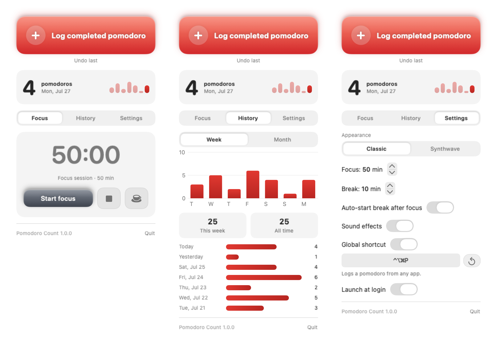
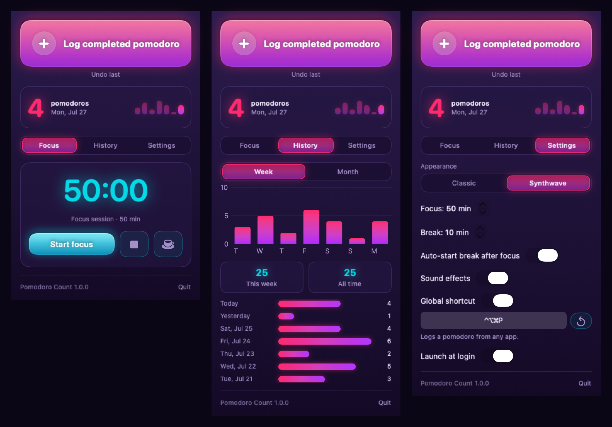

<h1 align="center">Pomodoro Count</h1>

<p align="center">
  A tiny macOS menu bar app that counts the pomodoros you finish
  <em>somewhere else</em>.
</p>

<p align="center">
  <a href="https://github.com/markgustetic/pomodoro-count/actions/workflows/ci.yml"></a>
  <a href="https://github.com/markgustetic/pomodoro-count/releases/latest"></a>
  
  <a href="LICENSE"></a>
</p>

<p align="center">
  
</p>

## Why

Physical pomodoro timers are lovely — a cube you twist, a dial you turn, no
screen involved. What they don't do is remember. Turn the cube twenty times in a
week and you have no idea you did.

Pomodoro Count is the tally that hardware is missing. Finish a pomodoro on your
timer, hit one button (or one keystroke), and it's counted. It has a built-in
timer too, if you want one, but that's not the point of it.

## Install

### Homebrew

```bash
brew install --cask --no-quarantine markgustetic/tap/pomodoro-count
```

`--no-quarantine` is needed because the app isn't signed with an Apple Developer
ID — see [below](#about-that-unsigned-warning).

### Download

Grab the zip from the [latest release](https://github.com/markgustetic/pomodoro-count/releases/latest),
unzip it, and drag **Pomodoro Count.app** to `/Applications`.

Each release ships a `.sha256` file. Since the app isn't signed, checking it is
the way to confirm your download is intact:

```bash
shasum -a 256 -c PomodoroCount-1.0.0.zip.sha256
```

### From source

Needs the Swift toolchain (Xcode or `xcode-select --install`) and
[`just`](https://github.com/casey/just):

```bash
git clone https://github.com/markgustetic/pomodoro-count.git
cd pomodoro-count
just setup     # build, install to /Applications, launch
```

### About that unsigned warning

Releases are **not** signed with an Apple Developer ID and **not** notarized —
that needs a paid Apple developer account, which this project doesn't have. So
macOS refuses the first launch.

Clear it once and macOS stops asking:

```bash
xattr -dr com.apple.quarantine "/Applications/Pomodoro Count.app"
```

Or right-click the app, choose **Open**, then **Open** again in the dialog.

The app is menu-bar-only and has no Dock icon — after launching, **look at the
top-right of your screen**, not the Dock.

## Using it

**Log a pomodoro.** Click the menu bar icon and hit **Log completed pomodoro**.
The panel closes and the count goes up. Mis-tapped? **Undo last**.

**Without opening anything.** <kbd>⌃</kbd><kbd>⌥</kbd><kbd>⌘</kbd><kbd>P</kbd>
logs one from any app. Record your own combo in Settings, or turn it off.

**The menu bar shows** today's count when idle, or a live countdown while a
session runs — with a cup glyph on breaks and a pause glyph when paused.

**Run a timer** if you want one. 50 / 10 minutes by default, configurable, with
optional auto-start break, a completion sound, and a notification.

**History** gives you a Week / Month chart, a per-day list, and this-week and
all-time totals. Today's count resets at midnight; past days stay in history.

**Two themes** — Classic and Synthwave.

<p align="center">
  
</p>

## Your data

One plain-text JSON file:

```
~/Library/Application Support/PomodoroCount/data.json
```

Timestamps of your pomodoros and your settings. That's everything. The app makes
**no network requests** — no telemetry, no analytics, no update check — and has
**no third-party dependencies**. Back it up or edit it as you like.

## Uninstall

```bash
brew uninstall --cask --zap pomodoro-count      # Homebrew, removes data too
```

Or drag the app to the Trash and, if you want the history gone as well:

```bash
rm -rf ~/Library/Application\ Support/PomodoroCount
```

Turn off **Launch at login** in Settings first, or macOS keeps a stale login item.

## Development

```bash
just            # list every recipe
just dev        # run from source
just test       # run the test suite
just preview    # render all three tabs to a PNG, no menu bar needed
just build      # build the .app into ./build
```

Tests need full Xcode — the Command Line Tools ship no test framework — but
`just test` finds it for you. See [CONTRIBUTING.md](CONTRIBUTING.md) for the
details, project layout, and what kinds of changes fit.

## License

[MIT](LICENSE).
